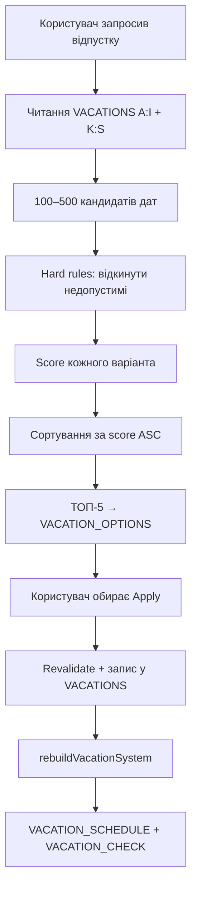

# Vacation Planner (Scheduler)

Google Apps Script **scheduler** for unit-wide vacation planning — not a
formula-based validator. The planner finds the **best** dates for the whole
unit, not merely admissible ones.

Runtime modules: `VacationPlannerConfig.gs`, `VacationPlannerTypes.gs`,
`VacationPlannerService.gs`, `VacationOptionsWriter.gs`, `VacationPlannerApi.gs`,
`VacationsRepository.gs`.

## Canonical sheet names

```javascript
const VACATION_SCHEDULE_CONFIG = {
  SHEETS: {
    SOURCE: "VACATIONS", // never "VACATION"
    SCHEDULE: "VACATION_SCHEDULE",
    CHECK: "VACATION_CHECK",
    OPTIONS: "VACATION_OPTIONS",
  },
};
```

Full scheduler tuning lives in `VACATION_PLANNER_CONFIG` (rules, scoring,
blocks, candidate limits). `VACATION_SCHEDULE_CONFIG` is a TZ alias for
`SHEETS` + `RULES`.

## Source data (`VACATIONS`)

| Block  | Columns | Meaning         |
| ------ | ------- | --------------- |
| First  | `A:I`   | перша відпустка |
| Second | `K:S`   | друга відпустка |

Both blocks are **equal** sources. Headers (each block):

`FML | Start date | End date | Vacation № | Active | Notify | Days | Travel | Interval check`

`VacationsRepository_.listAll()` **must merge** `A:I` and `K:S` into one array
before planner scoring, schedule rebuild, checks, person cards, or notifications.

Vacation № is stored as text: `перша відпустка` / `друга відпустка`.

## Scheduler algorithm



Lower **score** = better option for the unit.

## Scoring factors (unit-wide)

| Factor                            | Config key                   | Effect                |
| --------------------------------- | ---------------------------- | --------------------- |
| Deviation from desired date       | `DAY_DEVIATION`              | Personal preference   |
| Peak concurrent vacations         | `HIGH_LOAD_PERIOD`, `PEAK_*` | Minimize peaks        |
| Average load in period            | `RESERVE_LOAD`               | Preserve unit reserve |
| Starts too close to others        | `START_TOO_CLOSE`            | Spread departures     |
| Person interval vs preferred 180d | `INTERVAL_TOO_SHORT`         | Personal spacing      |
| Month start count                 | `OVERLOADED_MONTH`           | Spread within month   |
| Month total days vs median        | `MONTH_OVER_BALANCE`         | Even monthly load     |
| End near another start            | `END_NEAR_OTHER_START`       | Handover spacing      |
| Over max concurrent (hard rule)   | `OVER_LIMIT`                 | Rejected before score |

Hard rules (reject candidate): ≤2 vacations/person/year, ≥150d personal gap,
≤4 concurrent, ≥2d between different people's starts.

## Workflow

1. `WASB > Відпустки > Підібрати варіанти`
2. Enter FML, vacation number, desired start, duration, search window
3. Review top five rows in `VACATION_OPTIONS`
4. Select exactly one `Apply` checkbox
5. `WASB > Відпустки > Застосувати вибраний варіант`

Apply revalidates under a document lock, writes vacation 1 to `A:I` or
vacation 2 to `K:S`, then rebuilds `VACATION_SCHEDULE` and `VACATION_CHECK`.

## Menu (`WASB > Відпустки`)

| Action                       | Global function                    |
| ---------------------------- | ---------------------------------- |
| Оновити графік відпусток     | `rebuildVacationSystem()`          |
| Перевірити порушення         | `checkVacationScheduleOnly()`      |
| Підсвітити проблеми          | `highlightVacationProblems()`      |
| Сформувати звіт              | `generateVacationReport()`         |
| Підібрати варіанти           | `showVacationPlannerDialog()`      |
| Застосувати вибраний варіант | `applySelectedVacationOption()`    |
| Перевірити ручну дату        | `showValidateVacationDateDialog()` |

All menu handlers are global GAS functions (required for `onOpen` menus).

Planner actions require WASB working-action access (`maintainer` or above).

## Local verification

```bash
npm run ci:vacations
npm run ci
```
